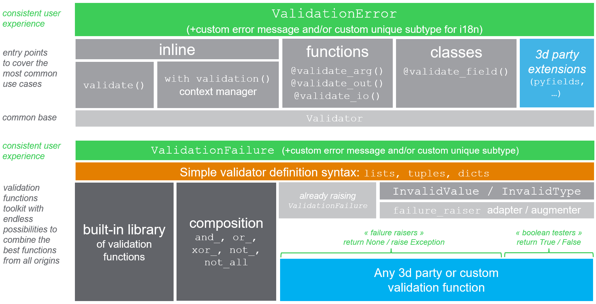

# python-validate (valid8)

[](https://pypi.python.org/pypi/valid8/) [](https://travis-ci.org/smarie/python-valid8) [](https://smarie.github.io/python-valid8/junit/report.html) [](https://codecov.io/gh/smarie/python-valid8)

[](https://smarie.github.io/python-valid8/) [](https://pypi.python.org/pypi/valid8/) [](https://pepy.tech/project/valid8) [](https://pepy.tech/project/valid8) [](https://github.com/smarie/python-valid8/stargazers)

*"valid8ing is not a crime" ;-)*

!!! warning "Major API changes in version `5.0.0`. See [changelog](changelog.md#500-more-betterness) for details."

## Overview

`valid8` provides user-friendly tools for 3 kind of "entry points":

 * general-purpose [**inline**](#1-usage-inline) validation (=anywhere in your code), 
 * [**function**](#a-functions) inputs/outputs validation 
 * [**class fields**](#b-class-fields) validation.

All these entry points raise consistent `ValidationError` including user-friendly details, with inheritance of `ValueError` / `TypeError` as appropriate. You can [**customize this error**](#3-custom-exceptions) so as to get unique error types convenient for i18n.

Now **what can you validate** ? Pretty much anything: you define validators by combining one or several elementary validation functions, with [minimalistic requirements](validation_funcs/a_basics.md). For this you can reuse [built-in functions](validation_funcs/b_base_validation_lib.md), 3d party functions, or write your own. You can even [augment existing functions](validation_funcs/a_basics.md#2-creating-failure-raisers-for-better-user-experience) with more user-friendly errors. The internal [composition framework](validation_funcs/d_composition.md) makes it easy to combine the best of all worlds for each situation.

So with a bird eye's view:



## Do I need validation ?

**type** (`TypeError`) and **value** (`ValueError`) validation is key to smooth user experience: if something fails, there is nothing more frustrating that a horrible cryptic error message. Good validation leads to less end-user frustration. So validation **has** to be done in user-facing production code. However it is maybe **already** done by someone else:

 - if your code is inside a **framework** that does the final application for you (`django`, `click`, `fastAPI` etc.), user inputs are probably already validated. So *validation in your code is optional (but can help)*.
 - if your code is a **low-level library** and you do not care about the final application, *validation is also optional (but it can help)*. Your library's documentation may replace the need for validation to some extend.
 - otherwise validation becomes quite **recommended** (you care about the **final application**'s user experience, and no application framework handles it already for you)

In [this page](why_validation.md), we try to explain what is validation, what you would need to do in order to implement it correctly and consistently by yourself (`assert` is not a viable solution unfortunately), and demonstrate **how much effort that would cost you**.

I searched and found tons of good and less good libraries [out there](other_libs.md), but did not find any that would provide a somehow generic answer covering 80% of the needs - especially the particular needs I had for class attributes validation in [`autoclass`](valid8_with_other.md#autoclass), [`attrs`](valid8_with_other.md#attrs) and now in [`pyfields`](https://smarie.github.io/python-pyfields/).

`valid8` provides tools to perform validation in a minimum number of lines and with built-in consistency, so that it hopefully becomes fun and easy to include in your code. 


## Installing

```bash
> pip install valid8
```

Optional but recommended:

 - If you wish to create highly compact object classes with field type+value validation, have a look at [`pyfields`, `attrs` or `autoclass`](valid8_with_other.md).

 - If you wish to define your own validation functions for functions and classes validation in a very compact way, you may wish to also install [mini_lambda](https://smarie.github.io/python-mini-lambda/). See below for examples.


## 0. Concepts

`valid8` relies on two main concepts:

 - [**entry points**](#1-entry-points) are responsible to apply validation to a specific part of your code. They all raise `ValidationError` when validation failed, and are the ones providing the context (they know that the variable is a function input or a class field, and know its name)
 
 - [**validation functions**](#2-validation-functions) are in charge of the validation *per se*. They receive the value to validate and should return `True` or `None` in case of success. Each entry point has a single main underlying validation function, automatically created from all the user-provided functions using the *simple validation function definition syntax*.


## 1. Entry points

### a - inline

`valid8` provides two validation methods that you may use anywhere in your code: 

 * `validate(...)` to perform the most simple validation tasks in one line of code
 * `with validation(...)` (or its alias `with validator(...) as v`) for any other validation task, in two or more lines of code


#### `validate`

The `validate` method is the most straightforward tool in this toolbox. It provides you with ways to quickly validate one or several of:

 * value is not `None`
 * value is an **instance** of one type in a reference set, or is a **subtype** of a reference set
 * value **equals** a reference item, 
 * value is **contained** in a set, **contains** a reference item, or is a **sub/superset** of a reference set 
 * value is **greater/smaller** than a reference (strict or not)
 * value **length** is fixed, or is **greater/smaller** than a reference.
 * one or several **other** validation functions (custom, 3d party)

For example:

```python
from valid8 import validate

surf = -1
validate('surface', surf, instance_of=int, min_value=0)
```

results in

```bash
ValidationError[ValueError]: Error validating [surface=-1]. \
   TooSmall: x >= 0 does not hold for x=-1. Wrong value: -1.
```

Note that the resulting exception object contains much of the available information (`var_name`, `var_value`, `failure`) as fields.

All functions from the built-in validation library are supported as explicit arguments as shown above, so that the method execution is the fastest possible. In addition you can add any other validation function with the `custom` argument:

```python
from mini_lambda import x

surf = 20
validate('surface', surf, instance_of=int, min_value=0, custom=[x ** 2 < 50])
```

yields

```
ValidationError[ValueError]: Error validating [surface=20]: \
    validation function [x ** 2 < 50] returned [False].
```

Here the custom validation function is implemented using `mini-lambda`, but any function will do ; the only requirement is that your function accepts one positional input and returns `True` or `None` in case of success.

You can easily define *custom validation functions* with composition, custom failure messages or even custom failure types. For example these are accepted:

```python
# custom failure message
validate('surface', surf, instance_of=int, min_value=0, 
         custom=[(x ** 2 < 50, 'x should be fairly small')])

# composition with detailed failure messages
validate('surface', surf, instance_of=int,
         custom={'x should be fairly small': x ** 2 < 50,
                 'x should be a multiple of 3': x % 3 == 0})
``` 

See [API reference](api_reference.md) for usage details, and below [validation functions](#2-validation-functions) and [validation errors](#3-custom-exceptions) to explore the various customization possibilities. 

#### `validator`/`validation`

The `validator` (alias `validation`) context manager allows you to define the validation procedure yourself, with any statement or function of your choice.

If you rely on **functions that output a boolean flag indicating success** (*"boolean testers"*), you simply have to plug that flag on the object provided by the context manager, as shown below:

```python
from valid8 import validator

surf = -1

with validator('surface', surf) as v:
    v.alid = surf > 0
```

Which yields

```bash
ValidationError[ValueError]: Error validating [surface=-1]:  \
   validation function [v.alid = surf > 0] returned [False].
```

Note that the text of the error displays the source code that led to that failure. 


If you rely on **functions that may raise exceptions** (*"failure raisers"*), `validator` will catch them and append them as the inner `failure` of the resulting `ValidationError`: 

```python
from math import isfinite

surf = 1j

with validator('surface', surf) as v:
    v.alid = surf > 0 and isfinite(surf)
```

yields

```bash
ValidationError[TypeError]: Error validating [surface=1j]. \
   InvalidType: Function [v.alid = surf > 0 and isfinite(surf)] raised \
       TypeError: '>' not supported between instances of 'complex' and 'int'.
```


With `validator` you are therefore **guaranteed** that any exception happening in the inner code block will be caught and turned into a friendly `ValidationError`, whatever the cause (`None` handling, known validation failures, unknown other errors). You therefore do not have to write the usual [if/else/try/except wrappers](why_validation.md#explicit-traditional-way) to handle all cases.


A couple important things to note:

 * the field name where you put the boolean flag does not matter, so if you prefer you can use alternate naming such as `with validator(...) as r:` and then `r.esults = `
 
 * there is no *need* to feed any result to the validator. If you rely on *failure raiser*-style base functions, for example a `check_uniform_sampling` or an `assert_series_equal`, you can just call them and the wrapper will assume that no exception means success. In such case the `validation` alias might make more sense in terms of readability:
 
```python
with validation('dataframe', df, instance_of=pd.DataFrame):
    check_uniform_sampling(df)
    assert_series_equal(df['a'], ref_series)
```

**Note on type checking with `isinstance`**
Although you *can* use the built-in `isinstance` method inside your validation code block, if you do it `valid8` will not be able to distinguish between `TypeError` and `ValueError`. Instead, please consider either 

 * using the `instance_of` parameter of `validation`:

```python
with validator('surface', surf, instance_of=int) as v:
    v.alid = surf > 0
```
    
 * or using the `assert_instance_of` validation method provided for this purpose:
    
```python
from valid8 import assert_instance_of, assert_subclass_of

with validator('surface', surf) as v:
    assert_instance_of(surf, int)
    v.alid = surf > 0
```

See [API reference](api_reference.md) for usage details, and below [validation functions](#2-validation-functions) and [custom exceptions](#3-custom-exceptions) to explore the various customization possibilities. 

### b - functions

The `@validate_arg` decorator adds input validation to a function. Here is an example where we decorate a `build_house` function:

```python
from mini_lambda import s, Len
from valid8 import validate_arg
from valid8.validation_lib import instance_of

@validate_arg('name', instance_of(str), Len(s) > 0, 
              help_msg='name should be a non-empty string')
def build_house(name, surface=None):
    print('Building house... DONE !')
    return name, surface
```

As you can see above, any number of base validation functions can be provided to the decorator - this will correspond to an implicit `and_` being performed, equivalent to one that you would have done with the built-in [composition framework](validation_funcs/d_composition.md). Here we validate the input argument `name` by chaining the function `instance_of(str)` (from the built-in [validation functions library](validation_funcs/b_base_validation_lib.md)) with a custom lambda function `Len(s) > 0` created using the [`mini_lambda`](https://smarie.github.io/python-mini-lambda/) syntax. 

Let's try it:

```bash
> build_house('sweet home', 200)    # Valid

> build_house('', 200)
InputValidationError[ValueError]: name should be a non-empty string. \
   Error validating input [name=''] for function [build_house]. \
   At least one validation function failed for value ''. \
     Successes: ["instance_of_<class 'str'>"] \
      / Failures: {'len(s) > 0': 'Returned False.'}.
```

We can see in this verbose exception all details of interest: first the custom `help_msg`; then the validated function and input name; and finally the composition failure resulting from one of the two base functions failing (`len(s) > 0` as stated). *Note that since `Len` is `mini_lambda`'s equivalent of `len`, the string representation is lowercase*

The `@validate_out` function decorator works the same way for output validation, except that you don't provide it with any name. 

#### nonable inputs/outputs

Here is a more complete example with both input and output validation:

```python
from mini_lambda import s, x, l, Len
from valid8 import validate_arg, validate_out
from valid8.validation_lib import instance_of, is_multiple_of

@validate_arg('name', instance_of(str), Len(s) > 0,
              help_msg='name should be a non-empty string')
@validate_arg('surface', (x >= 0) & (x < 10000), is_multiple_of(100),
              help_msg='Surface should be a multiple of 100 between 0 and 10000.')
@validate_out(instance_of(tuple), Len(l) == 2)
def build_house(name, surface=None):
    print('Building house... DONE !')
    return name, surface
```

Something surprising happens:

```bash
> build_house(None)
InputValidationError[TypeError]: name should be a non-empty string. \
   Error validating input [name=None] ...
   
> build_house('sweet home')         # No error !
> build_house('sweet home', None)   # No error !
```

No error is raised when `surface` is `None`, while our base validation functions should both fail in presence of `None`:

```bash
> is_multiple_of(100)(None)   
TypeError: unsupported operand type(s) for %: 'NoneType' and 'int'

> (Len(s) > 0).evaluate(None)
TypeError: object of type 'NoneType' has no len()
```

Indeed, by default `None` values have a special validation procedure depending on the function signature: 

 * if the input to validate has a default value of `None`it is considered ***nonable***. For this input, `None` values will **not** enter the validation procedure, and be sent directly to the function. In other words validation is skipped for `None`. The same principle goes for inputs and outputs that have a PEP484 `Optional[...]` type hint, with or without default value.
 
 * in the absence of `None` default value or `Optional[...]` type hint, the input or output is considered ***normal***. `None` values will be send to the validation function as usual, as it would be for non-`None` values

The default behaviour described above may not suit your needs, and can be changed by changing the `none_policy` keyword argument. Valid values are:

 * `NonePolicy.SKIP_IF_NONABLE_ELSE_VALIDATE`: the default behaviour described above
 * `NonePolicy.SKIP_IF_NONABLE_ELSE_FAIL`: same than the above, except that for ***normal*** inputs and outputs, `None` values will be rejected automatically - no need to test for `None` in your validation function.
 * `NonePolicy.SKIP`: validation will always be skipped for `None` values
 * `NonePolicy.FAIL`: validation will always fail for `None` values
 * `NonePolicy.VALIDATE`: validation will always be performed even for `None` values

See [API reference](api_reference.md) for usage details, and below [validation functions](#2-validation-functions) and [custom exceptions](#3-custom-exceptions) to explore the various customization possibilities. 

### c - class fields

If you use `pyfields` to define your classes, `valid8` is already embedded in the `field()` method: you should rather look [here](valid8_with_other.md#pyfields). Otherwise (for normal classes or classes with `attrs`, `autoclass`...) continue reading.

The `@validate_field` decorator adds field validation to a class. It is able to validate a field if the field is:

 * a [descriptor](https://docs.python.org/3.6/howto/descriptor.html#descriptor-example) - in which case it is equivalent to a `@validate_arg` added on the `__set__` function of the descriptor, but with a more user-friendly error message
 
 * a [property](https://docs.python.org/3.6/howto/descriptor.html#properties), in which case it is equivalent to a `@validate_arg` added on the `fset` function of the descriptor, but with a more user-friendly error message.
 
 * or a *constructor input*, in which case it is equivalent to a `@validate_arg` added on the constructor. In such case **WARNING** validation will only be called at initial object creation, not at subsequent field modifications!
 
Here is an example where we add validation to a `House` class with two fields:

```python
from valid8 import validate_field
from valid8.validation_lib import instance_of, is_multiple_of
from mini_lambda import x, s, Len

@validate_field('name', instance_of(str), Len(s) > 0,
                help_msg='name should be a non-empty string')
@validate_field('surface', (x >= 0) & (x < 10000), is_multiple_of(100),
                help_msg='Surface should be a multiple of100 between 0 and 10000')
class House:
    def __init__(self, name, surface=None):
        self.name = name
        self.surface = surface

    @property
    def surface(self):
        return self.__surface

    @surface.setter
    def surface(self, surface=None):
        self.__surface = surface

```

Let's try it:

```bash
> h = House('sweet home')  # valid

> h = House('')
ClassFieldValidationError[ValueError]: name should be a non-empty string. \
   Error validating field [name=] for class [House]. \
   At least one validation function failed for value ''. \
      Successes: ["instance_of_<class 'str'>"] / Failures: {'len(s) > 0': 'False'}

> h.surface = 10000
ClassFieldValidationError[ValueError]: Surface should be a multiple of 100 between 0 and 10000
   Error validating field [surface=10000] for class [House]. \
   At least one validation function failed for value 10000. \
      Successes: ['is_multiple_of_100'] \
        / Failures: {'(x >= 0) & (x < 10000)': 'False'}.

> h.name = '' # WARNING: does not raise ValidationError (no setter!)
```

For classes using `attrs` or `autoclass`, it [works too](valid8_with_other.md#for-classes).

As for functions, the default none policy is `SKIP_IF_NONABLE_ELSE_VALIDATE` but can be changed similarly to what we described in [previous section](#b-functions)

See [API reference](api_reference.md) for usage details, and below [validation functions](#2-validation-functions) and [custom exceptions](#3-custom-exceptions) to explore the various customization possibilities. 


## 2. Validation functions

We have seen above that all entry point validators (inline, function, class) provide a way for you to declare custom validation functions to use. Here are the resources that will get you started:

 * in [validation function basics](validation_funcs/a_basics.md) you will learn what is required to integrate any function, and how to improve existing functions

 * you can browse the bundled [validation functions library](validation_funcs/b_base_validation_lib.md) to find some common functions to reuse

 * as we already saw above, the [`mini_lambda`](https://smarie.github.io/python-mini-lambda/) syntax can be used to define some validation functions inline (such as `x > 0`) without writing `lambda x:`.

 * make sure that you check the [simple definition syntax](validation_funcs/c_simple_syntax.md). With it you will be able to easily define advanced validation functions.

 * the bundled [composition functions](validation_funcs/d_composition.md) can optionally be used to create more complex combinations than "and".


## 3. Custom exceptions

Various options are provided to customize the raised exception. These options are available on all entry points: both on `validate`, `validator`/`validation`, `@validate_arg`, `@validate_out`, `@validate_io` and `@validate_field`. 

### a - custom message

You can specify a custom error message that will be displayed at the beginning of the default message:

```python
from valid8 import validation

with validation('surface', surf, 
                help_msg="Surface should be a finite positive integer") as v:
    v.alid = surf > 0 and isfinite(surf)
```

yields for `surf = -1`

```bash
ValidationError[ValueError]: Surface should be a finite positive integer. \
    Error validating [surface=-1]: \
    validation function [v.alid = surf > 0 and isfinite(surf)] returned [False].
```

### b - custom type

Or even better, a custom error type, which is a good practice to ease internationalization (unique applicative error codes). The base `ValidationError` class provides default behaviours allowing you to define subclasses in a quite compact form:

```python
from valid8 import ValidationError, validate

class InvalidSurface(ValidationError):
    help_msg = 'Surface should be a positive integer'

validate('surface', surf, instance_of=int, min_value=0, 
            error_type=InvalidSurface)
``` 

yields for `surf = -1`

```bash
InvalidSurface[ValueError]: Surface should be a positive integer. \
   Error validating [surface=-1]. \
   TooSmall: x >= 0 does not hold for x=-1. Wrong value: -1.
```

Note that for function entry points, the custom type should inherit from `InputValidationError` or `OutputValidationError` respectively. For class entry points, the custom type should inherit from `ClassFieldValidationError`.

### c - message templating

Finally, the `help_msg` field acts as a string template that will receive any additional keyword argument thrown at the validation method. So you can define reusable error classes without too much hassle:

```python
class InvalidSurface(ValidationError):
    help_msg = 'Surface should be > {minimum}, found {var_value}'

validate('surface', surf, instance_of=int, min_value=0, 
         error_type=InvalidSurface, minimum=0)
```

yields

```bash
InvalidSurface[ValueError]: Surface should be > 0, found -1. \
   Error validating [surface=-1]. \
   TooSmall: x >= 0 does not hold for x=-1. Wrong value: -1.
```

Note: as shown in that last example, the value being validated is already sent to the help message string to format under the `'var_value'` key, so you do not need to pass it. 

Obviously you can further customize your exception subclasses if you wish.


#### d - `TypeError` or `ValueError`

`ValidationError` does not by default inherit from `TypeError` or `ValueError`, because in the general case, `valid8` has no means of knowing. But you may have noticed in all of the output message examples shown above that one of the two is still appearing each time in the resulting exception. This is because `valid8` automatically guesses: when a validation error happens, it recursively looks at the type of the failure cause for a `TypeError` or `ValueError` (default if nothing is found). It then **dynamically** creates an appropriate exception type inheriting both from `ValidationError` and from either `TypeError` or `ValueError` according to what has been found. This dynamic type is cached for speed considerations. It has some custom display methods that make it appear as follows:

```bash
> validate('surface', -1, instance_of=int, min_value=0)
ValidationError[ValueError]

> validate('surface', 1j, instance_of=int, min_value=0)
ValidationError[TypeError]
```

If you do not wish the automatic guessing to happen, you can always declare the inheritance explicitly by creating custom subclasses inheriting from the one of your choice, or both:

```python
class InvalidSurface(ValidationError, ValueError):
    help_msg = ""
```

If you create a custom subclass but do not inherit from `TypeError` nor `ValueError`, the automatic guessing will take place as usual.

## Main features

 * **Separation of validation intent** (entry points `validate`, `validator`, `@validate_arg`...) **from validation means** (base validation code / functions). Entry points provide a clear and consistent behaviour matching your applicative intent, hiding the diversity of base validation functions that you rely on to do it.
 
 * Clear entry points to **serve most common needs** related with validation:
 
    - *Inline validation*: two functions `validate` and `validator`/`validation` to perform validation anywhere in your code.
    
    - *Function validation*: two decorators `@validate_arg` and `@validate_out`, as well as a more limited `@validate_io`, to add input and output validation to any function. A manual decorator `decorate_with_validation` provides the same functionality for retrofit purposes.
    
    - *Class validation*: one decorator `@validate_field` to add validation to class fields.
    
 * **Consistent behaviour**: all defensive mode entry points provide the same behaviour, raising subclasses of `ValidationError` in case of failure, whatever the diversity of failure modes that can happen in base validation code. The exception object contains all contextual information in its fields so as to be easily usable by a global exception handler at application-level, for example for internationalization. Moreover, the appropriate `TypeError` or `ValueError` base class is dynamically added to the resulting exception type if not present already. Consistency is also ensured by the fact that all entry points rely on a common `Validator` class.
 
 * **Highly customizable**: all entry points can be customized so as to fit your application needs. In particular you probably do not want users to see `valid8` exceptions and messages, but rather *your* exceptions and messages. This is easy to do with the two `help_msg` and `error_type` options.

 * **python-first, not schema-first**. This library is intended to provide validation anywhere in your code, not only when data enters a web service, a CLI or a form. There already are [libs out there](other_libs.md#validation-of-data-at-the-applications-entry-point) for that purpose. `valid8` is rather meant to be as simple as possible and as open as possible to any kind of validation, even those that can not easily be described in a schema.

 * **Separation of *value* validation from *type* validation is possible**. `valid8` can be [combined](valid8_with_other#pep484-type-checkers) with any PEP484-based type validation library such as `enforce` or `pytypes`.

 * **Plays well with [pyfields](valid8_with_other.md#pyfields), [autoclass](valid8_with_other.md#autoclass) and [attrs](valid8_with_other.md#attrs)**. Declare validation once by annotating the class with `@validate_field`, and you're good to go!

**validation functions**
 
 * **Compliant with [most](accepted) base validation functions out there**. You may use base validation functions from anywhere including your own, and including `functools.partial`, `lambda` or even callable objects implementing the `__call__` magic method. The *only* requirement is that they return `True` or `None` in case of success ! The way they fail is not important, `valid8` tolerates all. If you wish to create your own, you can leverage the three [exception classes](accepted#built-in-exceptions) provided. 

 * **Built-in [library](base_validation_lib) of base validation functions**, by object type. Do not hesitate to contribute! Also, do not hesitate to rely on other libraries for dedicated object types such as [these](other_libs#domain-specific-validators-validators-for-specific-data-types-validators-without-framework), or to build your own !

 * **Built-in support for [mini_lambda](https://smarie.github.io/python-mini-lambda/)** to define base validation functions for the decorators, so that you do not need to write `lambda x:` everywhere, and the failure messages are far more easy to read. Besides the global error customization as well as **built-in syntax for [failure raiser definition](#d-advanced-composition)** allows you to easily add exception details to lambda expressions.
 
 * **Built-in composition framework**. Built-in functions `and_`, `or_`, `xor_`, `not_`, `not_all`, `failure_raiser`, `skip_on_none` and `fail_on_none` allow you to quickly create complex validation functions by reusing simpler ones, if you do not want to do it using `lambda` or `mini_lambda`. In particular, `and_` is implicitly used if you provide a list of base validation functions to any of the `valid8` decorators.
 

## Other Validation libraries

Many validation libraries are available on [PyPI](https://pypi.python.org/pypi?%3Aaction=search&term=valid&submit=search) already. The following [list](other_libs) is by far not exhaustive, but gives an overview. Do not hesitate to contribute to this list with a pull request! 


## Origin of this project

When it all started, I was just looking for a library providing a `@validate` annotation with a basic library of validators and some logic to associate them, so as to complete [autoclass](https://smarie.github.io/python-autoclass/). I searched and found tons of good and less good libraries [out there](#other-validation-libraries). However none of them was really a good fit for `autoclass`, for diverse reasons:

 * only a few of them were available as decorators
 * many of them were strongly mixing type validation and value validation, which is not necessary anymore thanks to PEP484. This was making the `autoclass` examples more confusing.
 * only a few of them were providing a simple yet consistent and reusable framework to deal with validation functions, combine them, etc. And the good ones were based on defining a Schema first, which seemed a bit 'too much' for me already.
 * finally, none of them was really encouraging the community to collaborate by displaying a catalog of base validation functions per data type, open to contributions.

So I first created the `@validate` goodie in [autoclass](https://smarie.github.io/python-autoclass/). When the project became more mature, I decided to extract it and make it independent, so that maybe the community will find it interesting. 

When this project grew, I found that its [embedded library of base validation functions](validation_funcs/b_base_validation_lib.md) was not flexible enough to cover a large variety of use cases, and will probably **never** be even if we try our best, so I came up with the complementary [mini_lambda syntax](https://smarie.github.io/python-mini-lambda/) which is now an independent project, typically used when your base validation function is very specific, but yet quite simple to write in plain python.

Later on I decided to create a better alternative to `autoclass`, named [`pyfields`](https://smarie.github.io/python-pyfields/). This challenged the `valid8` project once again to be simple, clear, and extensible. This gave version `5.0.0`.

## See Also

 * We had this [discussion on python-ideas](https://groups.google.com/forum/#!topic/python-ideas/ZSp9UKmnF2Q) to suggest a `validate` statement, functional equivalent of `assert_valid`, that would be built-in the python syntax so as to reduce parenthesis. An [issue](https://bugs.python.org/issue32590) was also created.

 * Julien Danjou's [Definitive Guide to Python Exceptions](https://julien.danjou.info/blog/2016/python-exceptions-guide). It was of great inspiration and help to design `valid8`'s exception hierarchy.

*Do you like this library ? You might also like [my other python libraries](https://github.com/smarie/OVERVIEW#python)* 

## Want to contribute ?

Details on the github page: [https://github.com/smarie/python-valid8](https://github.com/smarie/python-valid8)
